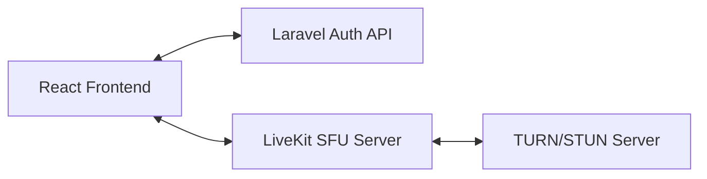

# LiveKit + Laravel Architecture (Research)

This document outlines the professional "Media Server" approach for future implementation. Use this as a reference when scaling beyond simple p2p or third-party solutions.

## 1. Overview
In a professional WebRTC setup, you need an SFU (Selective Forwarding Unit) to handle high-bandwidth video routing and a secure backend to manage access.



## 2. Laravel Backend (Token Generation)
The backend's primary job is to generate a JWT (JSON Web Token) that grants a user permission to join a specific room.

### Required Package
```bash
composer require livekit/server-sdk-php
```

### Controller Logic (`LiveKitController.php`)
```php
use LiveKit\AccessToken;
use LiveKit\VideoGrant;

public function getToken(Request $request) {
    $grant = new VideoGrant();
    $grant->setRoomJoin(true);
    $grant->setRoomName($request->room);
    $grant->setCanPublish(true);
    $grant->setCanSubscribe(true);

    $token = new AccessToken(
        env('LIVEKIT_API_KEY'),
        env('LIVEKIT_API_SECRET')
    );
    $token->addGrant($grant);
    $token->setIdentity($request->identity);
    $token->setMetadata($request->metadata); // e.g. 'admin' or 'guest'

    return response()->json(['token' => $token->toJwt()]);
}
```

## 3. Media Server (LiveKit SFU)
LiveKit is best run as a Docker container.

### `docker-compose.yaml` (Simplified)
```yaml
services:
  livekit:
    image: livekit/livekit-server
    command: --config /livekit.yaml
    ports:
      - "7880:7880"
      - "7881:7881"
      - "7882:7882/udp"
    volumes:
      - ./livekit.yaml:/livekit.yaml
```

## 4. TURN/STUN (Coturn)
Essential for mobile users and corporate firewalls. Without this, ~20% of users will fail to connect.
- **Tool:** `coturn`
- **Config:** Requires a public static IP and open ports `3478` (TCP/UDP).

## 5. Security Note
> [!WARNING]
> Never put `LIVEKIT_API_SECRET` in your React code. Always use a backend like Laravel to generate tokens.
